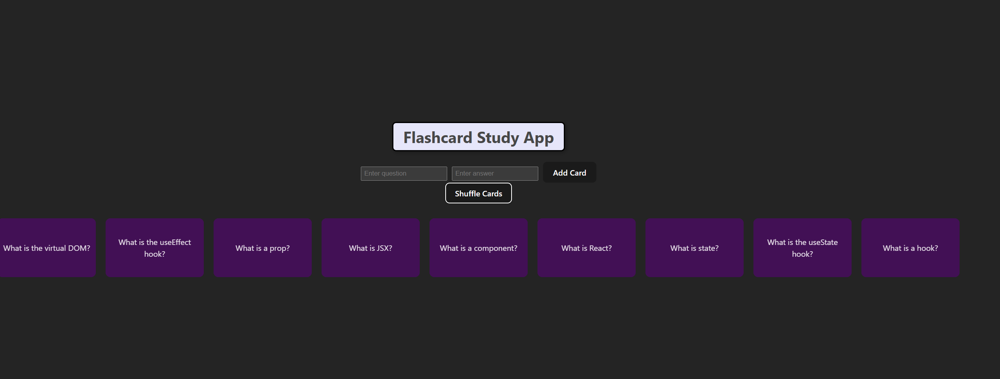

Flashcard Study App!

A simple React application to create, view, and shuffle flashcards for studying. Users can add new flashcards that fit their study needs and shuffle to really test their knowledge. 

Features:

-Add custom flashcards with a question and answer.

-View a list of all flashcards.

-Shuffle the flashcards.

